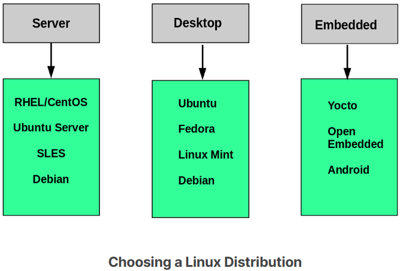
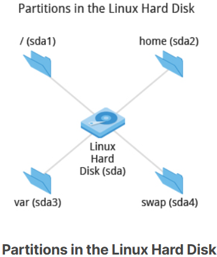
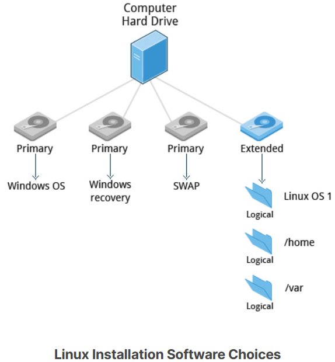

## Choosing a Linux Distribution

---
Suppose you intend to buy a new car. What factors do you need to consider to make a proper choice? Requirements which need to be taken into account include the size needed to fit your family in the vehicle, the type of engine and gas economy, your expected budget and available financing options, reliability record and after-sales services, etc.

Similarly, determining which distribution to deploy also requires planning. The figure shows some, but not all choices. Note that many embedded Linux systems use custom crafted contents, rather than Android or Yocto.

## Questions to Ask When Choosing a Distribution

---
- What is the main function of the system (server or desktop)?
- What types of packages are important to the organization? For example, web server, word processing, etc.
- How much hard disk space is required and how much is available? For example, when installing Linux on an embedded device, space is usually constrained.
- How often are packages updated?
- How long is the support cycle for each release? For example, LTS releases have long-term support.
- Do you need kernel customization from the vendor or a third party?
- What hardware are you running on? For example, it might be X86, ARM, PPC, etc.
- Do you need long-term stability? Can you accept (or need) a more volatile cutting edge system running the latest software?

## Linux Installation: Planning

---
The partition layout needs to be decided at the time of installation; it can be difficult to change later. While Linux systems handle multiple partitions by mounting them at specific points in the filesystem, and you can always modify the design later, it is always easier to try and get it right to begin with.

Nearly all installers provide a reasonable default layout, with either all space dedicated to normal files on one big partition and a smaller swap partition, or with separate partitions for some space-sensitive areas like `/home` and `/var`. You may need to override the defaults and do something different if you have special needs, or if you want to use more than one disk.

## Linux Installation: Software Choices

---
All installations include the bare minimum software for running a Linux distribution.

Most installers also provide options for adding categories of software. Common applications (such as the Firefox web browser and LibreOffice office suite), developer tools (like the vi and emacs text editors, which we will explore later in this course), and other popular services, (such as the Apache web server tools or MySQL database) are usually included. In addition, for any system with a graphical desktop, a chosen desktop (such as GNOME or KDE) is installed by default.

All installers set up some initial security features on the new system. One basic step consists of setting the password for the superuser (root) and setting up an initial user. In some cases (such as Ubuntu), only an initial user is set up; direct root login is not configured and root access requires logging in first as a normal user and then using sudo, as we will describe later. Some distributions will also install more advanced security frameworks, such as SELinux or AppArmor. For example, all Red Hat-based systems including Fedora and CentOS always use SELinux by default, and Ubuntu comes with AppArmor up and running.

## Linux Installation: Install Source

---
Like other operating systems, Linux distributions are provided on removable media such as USB drives and CDs or DVDs. Most Linux distributions also support booting a small image and downloading the rest of the system over the network. These small images are usable on media, or as network boot images, in which case it is possible to perform an install without using any local media.

Many installers can do an installation completely automatically, using a configuration file to specify installation options. This file is called a Kickstart file for Red Hat-based systems, an AutoYAST profile for SUSE-based systems, and a Preseed file for Debian-based systems.

Each distribution provides its own documentation and tools for creating and managing these files.

## Linux Installation: The Process

---
The actual installation process is pretty similar for all distributions.

After booting from the installation media, the installer starts and asks questions about how the system should be set up. These questions are skipped if an automatic installation file is provided. Then, the installation is performed.

Finally, the computer reboots into the newly-installed system. On some distributions, additional questions are asked after the system reboots.

Most installers have the option of downloading and installing updates as part of the installation process; this requires Internet access. Otherwise, the system uses its normal update mechanism to retrieve those updates after the installation is done.

## Linux Installation: The Warning

---
The demonstrations show how to install Linux directly on your machine, **erasing everything that was there**. While the demonstrations will not alter your computer, following these procedures in real life will erase all current data.

The Linux Foundation has a document: *"Preparing Your Computer for Linux Training"* (see below) that describes alternate methods of installing Linux without overwriting existing data. You may want to consult it, if you need to preserve the information on your hard disk.

These alternate methods are:
1. Re-partitioning your hard disk to free up enough room to permit dual boot (side-by-side) installation of Linux, along with your present operating system.
2. Using a host machine hypervisor program (such as VMWare's products or Oracle Virtual Box) to install a client Linux Virtual Machine.
3. Booting off of and using a Live CD or USB stick and not writing to the hard disk at all.

The first method is sometimes complicated and should be done when your confidence is high, and you understand the steps involved. The second and third methods are quite safe and make it difficult to damage your system.

