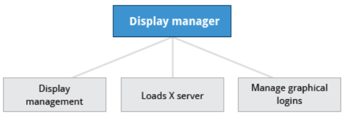

## Graphical Desktop

You can use either a Command Line Interface (CLI) or a Graphical User Interface (GUI) when using Linux. To work at the CLI, you have to remember which programs and commands are used to perform tasks, and how to quickly and accurately obtain more information about their use and options. On the other hand, using the GUI is often quick and easy. It allows you to interact with your system through graphical icons and screens. For repetitive tasks, the CLI is often more efficient, while the GUI is easier to navigate if you do not remember all the details or do something only rarely.

We will learn how to manage sessions using the GUI forthe three Linux distribution families that we cover the most in this course: Red Hat (CentOS, Fedora), SUSE (openSUSE), and Debian (Ubuntu, Mint). Since we are using the GNOME-based variant of openSUSE rather than the KDE-based one, all are actually quite similar. If you are using KDE (or other Linux desktops such as XFCE), your experience will vary somewhat from what is shown, but not in any intrinsically difficult way, as user interfaces have converged to certain well-known behaviors on modern operating systems. In subsequent sections of this course we will concentrate in great detail on the command line interface, which is pretty much the same on all distributions.

## X Window System

Generally, in a Linux desktop system, the X Window System is loaded as one of the final steps in the boot process. It is often just called X.

A service called the **Display Manager** keeps track of the displays being provided and loads the X server (so-called, because it provides graphical services to applications, sometimes called X clients). The display manager also handles graphical logins and starts the appropriate desktop environment after a user logs in.

X is rather old software; it dates back to the mid 1980s and, as such, has certain deficiencies on modern systems (for example, with security), as it has been stretched rather far from its original purposes. A newer system, known as Wayland, is gradually superseding it and is the default display system for Fedora, RHEL 8, and other recent distributions.  For the most part, it looks just like X to the user, although under the hood it is quite different.

## More About X

A desktop environment consists of a session manager, which starts and maintains the components of the graphical session, and the window manager, which controls the placement and movement of windows, window title-bars, and controls.

Although these can be mixed, generally a set of utilities, session manager, and window manager are used together as a unit, and together provide a seamless desktop environment.

If the display manager is not started by default in the default runlevel, you can start the graphical desktop different way, after logging on to a text-mode console, by running `startx` from the command line. Or, you can start the display manager (`gdm`, `lightdm`, `kdm`, `xdm`, `etc`.) manually from the command line. This differs from running `startx` as the display managers will project a sign in screen. We discuss them next.

## GUI Startup

When you install a desktop environment, the X display manager starts at the end of the boot process. It is responsible for starting the graphics system, logging in the user, and starting the user’s desktop environment. You can often select from a choice of desktop environments when logging in to the system.

The default display manager for GNOME is called gdm. Other popular display managers include lightdm (used on Ubuntu before version 18.04 LTS) and kdm (associated with KDE).

## GNOME Desktop Environment

GNOME is a popular desktop environment with an easy-to-use graphical user interface. It is bundled as the default desktop environment for most Linux distributions, including Red Hat Enterprise Linux (RHEL), Fedora, CentOS, SUSE Linux Enterprise, Ubuntu and Debian. GNOME has menu-based navigation and is sometimes an easy transition to accomplish for Windows users. However, as you will see, the look and feel can be quite different across distributions, even if they are all using GNOME.

Another common desktop environment very important in the history of Linux and also widely used is KDE, which has often been used in conjunction with SUSE and openSUSE. Other alternatives for a desktop environment include Unity (present on older Ubuntu, but still based on GNOME), XFCE and LXDE. As previously mentioned, most desktop environments follow a similar structure to GNOME, and we will restrict ourselves mostly to it to keep things less complex.

## gnome-tweaks

Most common settings, both personal and system-wide, are to be found by clicking in the upper right-hand corner, on either a gear or other obvious icon, depending on your Linux distribution.

However, there are many settings which many users would like to modify which are not thereby accessible; the default settings utility is unfortunately rather limited in modern GNOME-based distributions. Unfortunately, the quest for simplicity has actually made it difficult to adapt your system to your tastes and needs.

Fortunately, there is a standard utility, `gnome-tweaks`, which exposes many more setting options. It also permits you to easily install extensions by external parties. Not all Linux distributions install this tool by default, but it is always available (older distributions used the name `gnome-tweak-tool`). You may have to run it by hitting `Alt-F2` and then typing in the name. You may want to add it to your `Favorites` list as we shall discuss.

As discussed in the next chapter, some recent distributions have taken most of the functionality out of this tool and placed it in a new one, called `gnome-extensions-app`.

In the screenshot below, the keyboard mapping is being adjusted so the useless `CapsLock` key can be used as an additional `Ctrl` key; this saves users who use `Ctrl` a lot (such as **emacs** aficionados) from getting physically damaged by pinkie strain.

## Changing the Theme

- `gnome-tweaks`, `gnome-extensions-app`

To change your theme, you may have noticed a tab in the window where you changed the background labeled `Theme`. If it is present, you can click on this tab and select one of the available themes or click on `Customize` to experiment with your own creations.

However, for GNOME 3, you can no longer do anything this way except to set the background. Instead, you have to run `gnome-tweaks` (or `gnome-tweak-tool`) and then scroll down to `Theme` or `Appearance > Theme`.

Note that many other settings one might expect to actually be in the Settings menu are now configurable only through gnome-tweaks. This can cause a lot of frustration until you discover this fact.
