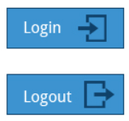

## Logging In and Out

## Locking the Screen

It is often a good idea to lock your screen to prevent other people from accessing your session while you are away from your computer.

**NOTE**: *This does not suspend the computer; all your applications and processes continue to run while the screen is locked.*

There are two ways to lock your screen:

Using the graphical interface
Clicking in the upper-right corner of the desktop, and then clicking on the lock icon.
Using the keyboard shortcut `SUPER-L `
(The `SUPER` key is also known as the `Windows` key). 
The keyboard shortcut for locking the screen can be modified by altering keyboard settings, the exact prescription varying by distribution, but not hard to ascertain.

To re-enter the desktop session you just need to provide your password again.

The screenshot below shows how to lock the screen for Ubuntu. The details vary little in modern distributions.

## Switching Users

Linux is a true multi-user operating system, which allows more than one user to be simultaneously logged in. If more than one person uses the system, it is best for each person to have their own user account and password. This allows for individualized settings, home directories, and other files. Users can take turns using the machine, while keeping everyone's sessions alive, or even be logged in simultaneously through the network.

## Suspending

All modern computers support `Suspend` (or `Sleep`) Mode when you want to stop using your computer for a while. Suspend Mode saves the current system state and allows you to resume your session more quickly while remaining on, but uses very little power in the sleeping state. It works by keeping your system’s applications, desktop, and so on, in system RAM, but turning off all of the other hardware. This shortens the time for a full system start-up as well as conserves battery power. One should note that modern Linux distributions actually boot so fast that the amount of time saved is often minor.