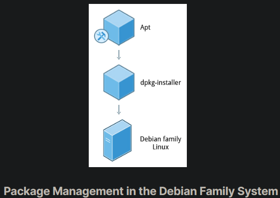
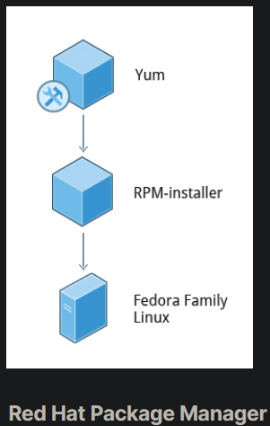
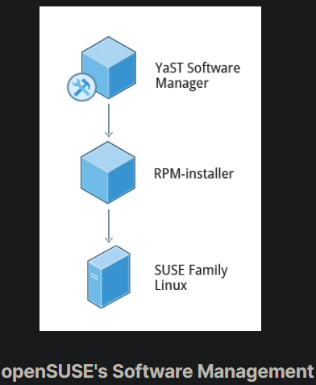

## Installing and Updating Software

Each package in a Linux distribution provides one piece of the system, such as the Linux kernel, the C compiler, utilities for manipulating text or configuring the network, or for your favorite web browsers and email clients.

Packages often depend on each other. For example, because your email client can communicate using SSL/TLS, it will depend on a package which provides the ability to encrypt and decrypt SSL and TLS communication, and will not install unless that package is also installed at the same time.

All systems have a lower-level utility which handles the details of unpacking a package and putting the pieces in the right places. Most of the time, you will be working with a higher-level utility which knows how to download packages from the Internet and can manage dependencies and groups for you.

In this section, you will learn how to install and update software in Linux using the Debian packaging system (used by systems such as Ubuntu as well) and RPM packaging systems (which is used by both Red Hat and SUSE family systems). These are the main ones in use although there are others which work well for other distributions which are less used.

## Debian Packaging

dpkg is the underlying package manager for these systems. It can install, remove, and build packages. Unlike higher-level package management systems, it does not automatically download and install packages and satisfy their dependencies.

For Debian-based systems, the higher-level package management system is the Advanced Package Tool (APT) system of utilities. Generally, while each distribution within the Debian family uses APT, it creates its own user interface on top of it (for example, apt and apt-get, synaptic, gnome-software, Ubuntu Software Center, etc). Although apt repositories are generally compatible with each other, the software they contain generally is not. Therefore, most repositories target a particular distribution (like Ubuntu), and often software distributors ship with multiple repositories to support multiple distributions. Demonstrations are shown later in this section.

## Red Hat Package Manager (RPM)

Red Hat Package Manager (RPM) is the other package management system popular on Linux distributions. It was developed by Red Hat, and adopted by a number of other distributions, including SUSE/openSUSE, Mageia, CentOS, Oracle Linux, and others.

The higher-level package manager differs between distributions. Red Hat family distributions historically use RHEL/CentOS and Fedora uses dnf, while retaining good backwards compatibility with the older yum program. SUSE family distributions such as openSUSE also use RPM, but use the zypper interface.

## openSUSE’s YaST Software Management

The Yet another Setup Tool (YaST) software manager is similar to other graphical package managers. It is an RPM-based application. You can add, remove, or update packages using this application very easily. To access the YaST software manager:

1. Click Activities
2. In the Search box, type YaST
3. Click the YaST icon
4. Click Software Management

You can also find YaST by clicking on Applications > Other-YaST, which is a strange place to put it.

openSUSE’s YaST software management application is similar to the graphical package managers in other distributions. A demonstration of the YaST software manager is shown later in this section.