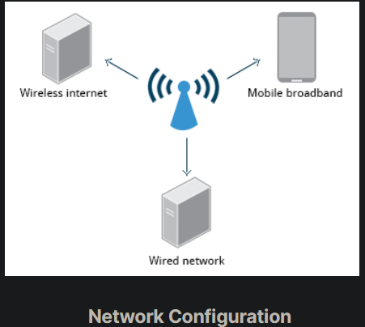

## Network Configuration

All Linux distributions have network configuration files, but file formats and locations can differ from one distribution to another. Hand editing of these files can handle quite complicated setups, but is not very dynamic or easy to learn and use. Network Manager was developed to make things easier and more uniform across distributions. It can list all available networks (both wired and wireless), allow the choice of a wired, wireless, or mobile broadband network, handle passwords, and set up Virtual Private Networks (VPNs). Except for unusual situations, it is generally best to let Network Manager establish your connections and keep track of your settings.

In this section, you will learn how to manage network connections, including wired and wireless connections, and mobile broadband and VPN connections.

## Wired and Wireless Connections

Wired connections usually do not require complicated or manual configuration. The hardware interface and signal presence are automatically detected, and then Network Manager sets the actual network settings via Dynamic Host Configuration Protocol (DHCP).

For static configurations that do not use DHCP, manual setup can also be done easily through Network Manager. You can also change the Ethernet Media Access Control (MAC) address if your hardware supports it. The MAC address is a unique hexadecimal number of your network card.

Wireless networks are usually not connected by default. You can view the list of available wireless networks and see which one (if any) you are currently connected to by using Network Manager. You can then add, edit, or remove known wireless networks, and also specify which ones you want connected by default when present.

## Configuring Wireless Connections

To configure a wireless network in any recent GNOME-based distribution:

Click on the upper-right corner of the top panel, which brings up a settings and/or network window. While the exact appearance will depend on Linux distribution and version, it will always be possible to click on a Wi-Fi submenu, as long as the hardware is present. Here is an example from a RHEL 8 system:

## Mobile Broadband and VPN Connections

You can set up a mobile broadband connection with Network Manager, which will launch a wizard to set up the connection details for each connection.

Once the configuration is done, the network is configured automatically each time the broadband network is attached.

Network Manager can also manage your VPN connections.

It supports many VPN technologies, such as native IPSec, Cisco OpenConnect (via either the Cisco client or a native open source client), Microsoft PPTP, and OpenVPN.

You might get support for VPN as a separate package from your distributor. You need to install this package if your preferred VPN is not supported.

## 