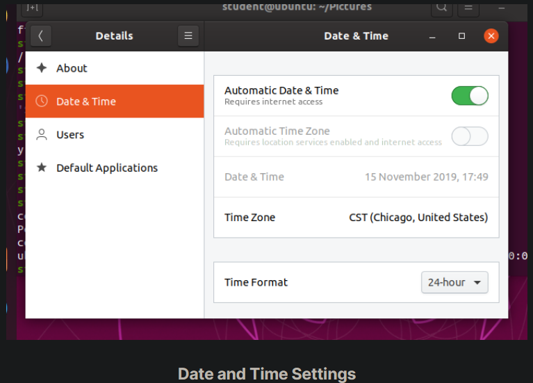

## System Settings

The System Settings panel allows you to control most of the basic configuration options and desktop settings, such as specifying the screen resolution, managing network connections, or changing the date and time of the system.

For the GNOME Desktop Manager, one clicks on the upper right-hand corner and then selects the tools image (screwdriver crossed with a wrench or a gear). Depending on your distribution, you may find other ways to get into the settings configuration as well. You will also find variation in the menu layout between Linux distributions and versions, so you may have to hunt for the settings you need to examine or modify.

## System Settings Menus

To get deeper into configuration, one can click on the Devices on the previous menu in order to configure items like the display, the keyboard, the printers, etc.

One can also click on the Users icon (which may be under Details) to set values for system users, such as their login picture, password, etc.

## gnome-tweaks

A lot of personalized configuration settings do not appear on the settings menus. Instead, you have to launch a tool called either gnome-tweaks (or gnome-tweak-tool on older Linux distributions). We have not really discussed working at the command line yet, but you can always launch a program such as this by doing Alt-F2 and typing in the command. Some distributions have a link to the tweaks menus in the settings, but for some mysterious reason, many obscure this tool's existence, and it becomes hard to discover how to modify even rather basic desktop attributes and behavior.

Important things you can do with this tool include selecting a theme, configuring extensions which you can get from your distribution or download from the Internet, control fonts, modify the keyboard layout, and set which programs start when you login.

The most recent GNOME versions have removed a lot of the functionality of gnome-tweaks; extensions now have to be configured using a new app called gnome-extensions-app. The reasoning for this is obscure.

The screenshot here is from a Red Hat system with quite a few extensions installed, but not all being used.

## Display Settings

Clicking on Settings > Displays (or Settings > Devices > Displays) will expose the most common settings for changing  the desktop appearance. These settings function independently of the specific display drivers you are running. The exact appearance will depend enormously on how many monitors you have and other factors, such as Linux distribution and particular version.

If your system uses a proprietary video card driver (usually from nVidia or AMD), you will probably have a separate configuration program for that driver. This program may give more configuration options, but may also be more complicated, and might require sysadmin (root) access. If possible, you should configure the settings in the Displays panel rather than with the proprietary program.

The X server, which actually provides the GUI, uses /etc/X11/xorg.conf as its configuration file if it exists; In modern Linux distributions, this file is usually present only in unusual circumstances, such as when certain less common graphic drivers are in use. Changing this configuration file directly is usually for more advanced users.

## Setting Resolution and Configuring Multiple Screens

While your system will usually figure out the best resolution for your screen automatically, it may get this wrong in some cases, or you might want to change the resolution to meet your needs.

You can accomplish this using the Displays panel. The switch to the new resolution will be effective when you click Apply, and then confirm that the resolution is working. In case the selected resolution fails to work or you are just not happy with the appearance, the system will switch back to the original resolution after a short timeout. Once again, the exact appearance of the configuration screen will vary a lot between distributions and versions, but usually is rather intuitive and easy, once you find the configuration menus.

In most cases, the configuration for multiple displays is set up automatically as one big screen spanning all monitors, using a reasonable guess for screen layout. If the screen layout is not as desired, a check box can turn on mirrored mode, where the same display is seen on all monitors. Clicking on a particular monitor image lets you configure the resolution of each one, and whether they make one big screen, or mirror the same video, etc.

## Date and Time Settings

By default, Linux always uses Coordinated Universal Time (UTC) for its own internal timekeeping. Displayed or stored time values rely on the system time zone setting to get the proper time. UTC is similar to, but more accurate than, Greenwich Mean Time (GMT).

If you click on the time displayed on the top panel, you can adjust the format with which the date and time is shown; on some distributions, you can also alter the values.

The more detailed date and time settings can be selected from the Date & Time window in the System Settings Menu.

The "automatic" settings are referring to the use of Network Time Protocol (NTP), which we discuss next.

## Network Time Protocol

The Network Time Protocol (NTP) is the most popular and reliable protocol for setting the local time by consulting established Internet servers. Linux distributions always come with a working NTP setup, which refers to specific time servers run or relied on by the distribution. This means that no setup, beyond "on" or "off", is generally required for network time synchronization.

