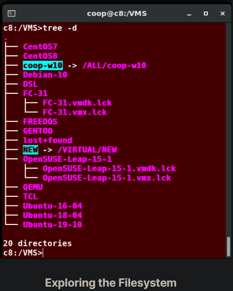

## Logging In and Out

An available text terminal will prompt for a username (with the string login:) and password. When typing your password, nothing is displayed on the terminal (not even a * to indicate that you typed in something), to prevent others from seeing your password. After you have logged into the system, you can perform basic operations.

Once your session is started (either by logging into a text terminal or via a graphical terminal program), you can also connect and log into remote systems by using Secure SHell (SSH). For example, by typing ssh student@remote-server.com, SSH would connect securely to the remote machine (remote-server.com) and give student a command line terminal window, using either a password (as with regular logins) or cryptographic key to sign in without providing a password to verify the identity.

## Rebooting and Shutting Down

The preferred method to shut down or reboot the system is to use the shutdown command. This sends a warning message, and then prevents further users from logging in. The init process will then control shutting down or rebooting the system. It is important to always shut down properly; failure to do so can result in damage to the system and/or loss of data.

The halt and poweroff commands issue shutdown -h to halt the system; reboot issues shutdown -r and causes the machine to reboot instead of just shutting down. Both rebooting and shutting down from the command line requires superuser (root) access.

When administering a multi-user system, you have the option of notifying all users prior to shutdown, as in:

`$ sudo shutdown -h 10:00 "Shutting down for scheduled maintenance."`

NOTE: On recent Wayland-based Linux distributions, broadcast messages do not appear on terminal emulation sessions running on the desktop; they appear only on the VT console displays.

## Locating Applications

Depending on the specifics of your particular distribution's policy, programs and software packages can be installed in various directories. In general, executable programs and scripts should live in the /bin, /usr/bin, /sbin, /usr/sbin directories, or somewhere under /opt. They can also appear in /usr/local/bin and /usr/local/sbin, or in a directory in a user's account space, such as /home/student/bin.

One way to locate programs is to employ the which utility. For example, to find out exactly where the diff program resides on the filesystem:

`$ which diff`\
`/usr/bin/diff`

If which does not find the program, whereis is a good alternative because it looks for packages in a broader range of system directories:

`$ whereis diff`\
`diff: /usr/bin/diff /usr/share/man/man1/diff.1.gz /usr/share/man/man1p/diff.1p.gz`

as well as locating source and man files packaged with the program.

## Accessing Directories

When you first log into a system or open a terminal, the default directory should be your home directory. You can print the exact path of this by typing echo $HOME. Many Linux distributions actually open new graphical terminals in $HOME/Desktop. The following commands are useful for directory navigation:

## Understanding Absolute and Relative Paths

Understanding Absolute and Relative Paths
- Absolute pathname\
An absolute pathname begins with the root directory and follows the tree, branch by branch, until it reaches the desired directory or file. Absolute paths always start with /.
- Relative pathname\
A relative pathname starts from the present working directory. Relative paths never start with /.

Multiple slashes (/) between directories and files are allowed, but all but one slash between elements in the pathname is ignored by the system. ////usr//bin is valid, but seen as /usr/bin by the system.

Most of the time, it is most convenient to use relative paths, which require less typing. Usually, you take advantage of the shortcuts provided by: . (present directory), .. (parent directory) and ~ (your home directory).

For example, suppose you are currently working in your home directory and wish to move to the /usr/bin directory. The following two ways will bring you to the same directory from your home directory:

- Absolute pathname method\
`$ cd /usr/bin`
- Relative pathname method\
`$ cd ../../usr/bin`

## Exploring the Filesystem

Traversing up and down the filesystem tree can get tedious. The tree command is a good way to get a bird’s-eye view of the filesystem tree. Use tree -d to view just the directories and to suppress listing file names.

## Hard Links

The ln utility is used to create hard links and (with the -s option) soft links, also known as symbolic links or symlinks. These two kinds of links are very useful in UNIX-based operating systems.

Suppose that file1 already exists. A hard link, called file2, is created with the command:

`$ ln file1 file2`

Note that two files now appear to exist. However, a closer inspection of the file listing shows that this is not quite true.

`$ ls -li file1 file2`

The -i option to ls prints out in the first column the inode number, which is a unique quantity for each file object. This field is the same for both of these files; what is really going on here is that it is only one file, but it has more than one name associated with it, as is indicated by the 2 that appears in the ls output. Thus, there was already another object linked to file1 before the command was executed.

Hard links are very useful and they save space, but you have to be careful with their use, sometimes in subtle ways. For one thing, if you remove either file1 or file2 in the example, the inode object (and the remaining file name) will remain, which might be undesirable, as it may lead to subtle errors later if you recreate a file of that name.

If you edit one of the files, exactly what happens depends on your editor; most editors, including vi and gedit, will retain the link by default, but it is possible that modifying one of the names may break the link and result in the creation of two objects.

## Soft (Symbolic) Links

Soft (or Symbolic) links are created with the -s option, as in:

`$ ln -s file1 file3`\
`$ ls -li file1 file3`

Notice file3 no longer appears to be a regular file, and it clearly points to file1 and has a different inode number.

Symbolic links take no extra space on the filesystem (unless their names are very long). They are extremely convenient, as they can easily be modified to point to different places. An easy way to create a shortcut from your home directory to long pathnames is to create a symbolic link.

Unlike hard links, soft links can point to objects even on different filesystems, partitions, and/or disks and other media, which may or may not be currently available or even exist. In the case where the link does not point to a currently available or existing object, you obtain a dangling link.

## Navigating the Directory History

The cd command remembers where you were last, and lets you get back there with cd -. For remembering more than just the last directory visited, use pushd to change the directory instead of cd; this pushes your starting directory onto a list. Using popd will then send you back to those directories, walking in reverse order (the most recent directory will be the first one retrieved with popd). The list of directories is displayed with the dirs command.

## 