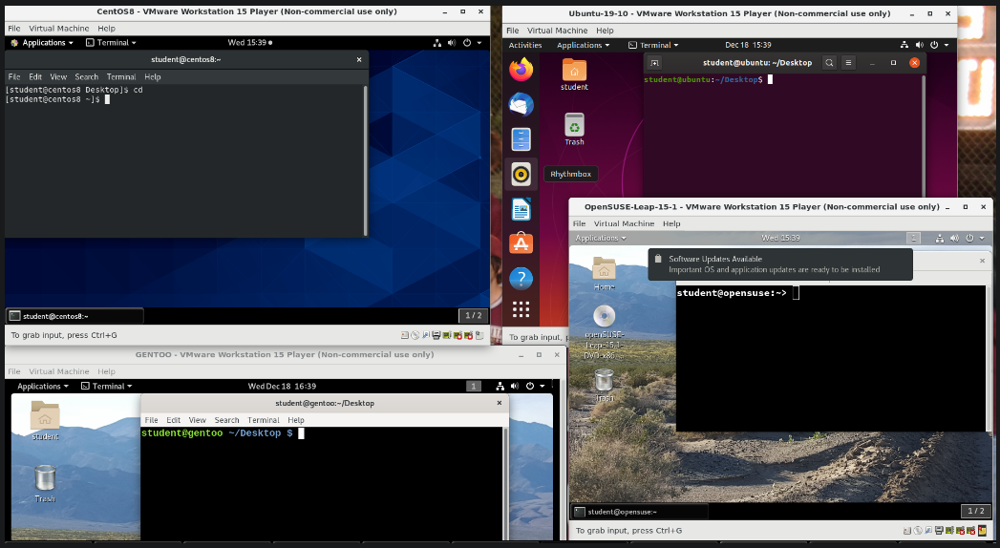
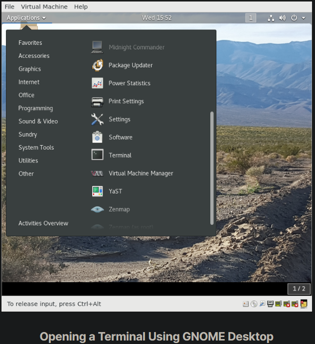
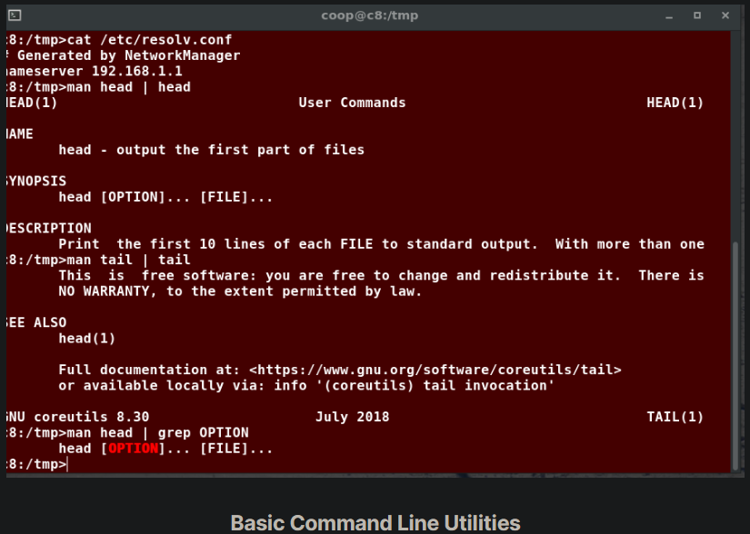
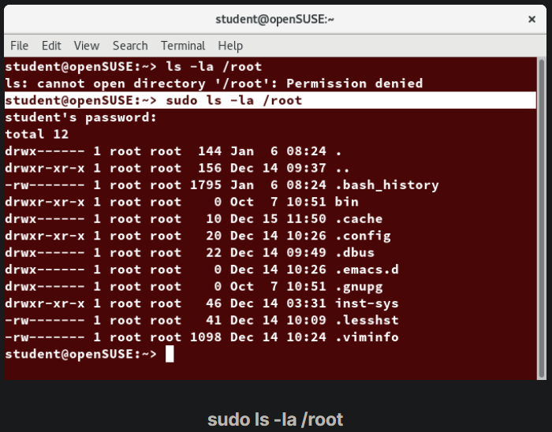
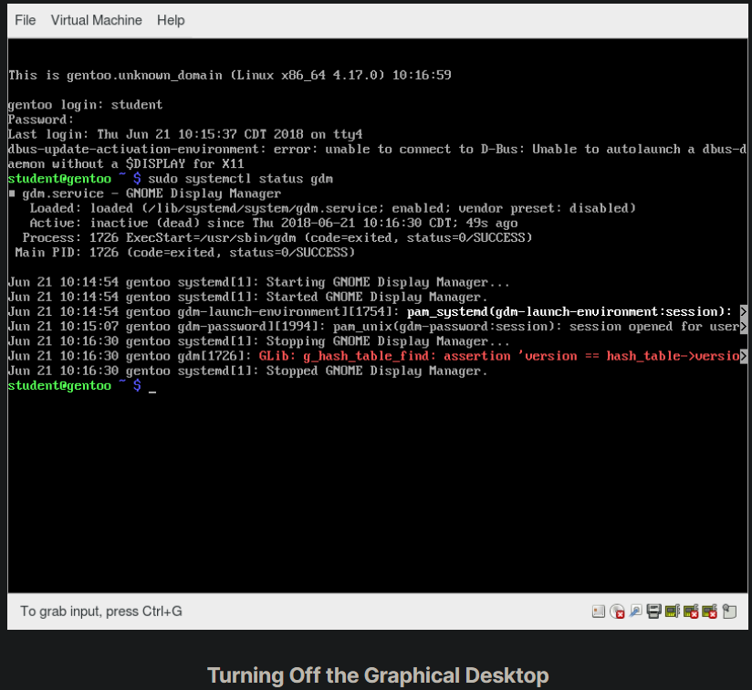

## Introduction to the Command Line

Linux system administrators spend a significant amount of their time at a command line prompt. They often automate and troubleshoot tasks in this text environment. There is a saying, "graphical user interfaces make easy tasks easier, while command line interfaces make difficult tasks possible". Linux relies heavily on the abundance of command line tools. The command line interface provides the following advantages:

- No GUI overhead is incurred.
- Virtually any and every task can be accomplished while sitting at the command line.
- You can implement scripts for often-used (or easy-to-forget) tasks and series of procedures.
- You can sign into remote machines anywhere on the Internet.
- You can initiate graphical applications directly from the command line instead of hunting through menus.
- While graphical tools may vary among Linux distributions, the command line interface does not.

## Using a Text Terminal on the Graphical Desktop

A terminal emulator program emulates (simulates) a standalone terminal within a window on the desktop. By this, we mean it behaves essentially as if you were logging into the machine at a pure text terminal with no running graphical interface. Most terminal emulator programs support multiple terminal sessions by opening additional tabs or windows.

By default, on GNOME desktop environments, the gnome-terminal application is used to emulate a text-mode terminal in a window. Other available terminal programs include:

- xterm
- konsole (default on KDE)
- terminator

## Launching Terminal Windows

To open a terminal on any system using a recent GNOME desktop click on Applications > System Tools > Terminal or Applications > Utilities > Terminal. If you do not have the Applications menu, you will have to install the appropriate gnome-shell-extension package and turn on with gnome-tweaks.

To open a terminal on any system using a recent GNOME desktop click on Applications > System Tools > Terminal or Applications > Utilities > Terminal. If you do not have the Applications menu, you will have to install the appropriate gnome-shell-extension package and turn on with gnome-tweaks.

You can also hit Alt-F2 and type in either gnome-terminal or konsole, whichever is appropriate.

Because distributions have had a history of burying opening up a command line terminal, and the place in menus may vary in the desktop GUI, It is a good idea to figure out how to "pin" the terminal icon to the panel, which might mean adding it to the Favorites grouping on GNOME systems.

## Some Basic Utilities

There are some basic command line utilities that are used constantly, and it would be impossible to proceed further without using some of them in simple form before we discuss them in more detail. A short list has to include:

- `cat`: used to type out a file (or combine files).
- `head`: used to show the first few lines of a file.
- `tail`: used to show the last few lines of a file.
- `man`: used to view documentation.

The screenshot shows elementary uses of these programs. Note the use of the pipe symbol (|) used to have one program take as input the output of another.

For the most part, we will only use these utilities in screenshots displaying various activities, before we discuss them in detail.

## The Command Line

Most input lines entered at the shell prompt have three basic elements:

- Command
- Options
- Arguments

The command is the name of the program you are executing. It may be followed by one or more options (or switches) that modify what the command may do. Options usually start with one or two dashes, for example, -p or --print, in order to differentiate them from arguments, which represent what the command operates on.

However, plenty of commands have no options, no arguments, or neither. In addition, other elements (such as setting environment variables) can also appear on the command line when launching a task.

## sudo

All the demonstrations created have a user configured with sudo capabilities to provide the user with administrative (admin) privileges when required. sudo allows users to run programs using the security privileges of another user, generally root (superuser). 

On your own systems, you may need to set up and enable sudo to work correctly. To do this, you need to follow some steps that we will not explain in much detail now, but you will learn about later in this course. When running on Ubuntu and some other recent distributions, sudo is already always set up for you during installation. On other Linux distributions, you will likely need to set up sudo to work properly for you after the initial installation.

Next, you will learn the steps to set up and run sudo on your system.

## Steps for Setting Up and Running sudo

If your system does not already have sudo set up and enabled, you need to do the following steps:

1. You will need to make modifications as the administrative, or superuser, root. While sudo will become the preferred method of doing this, we do not have it set up yet, so we will use su (which we will discuss later in detail) instead. At the command line prompt, type su and press Enter. You will then be prompted for the root password, so enter it and press Enter. You will notice that nothing is printed; this is so others cannot see the password on the screen. You should end up with a different looking prompt, often ending with ‘#’. For example:
`$ su Password:``#`
2. Now, you need to create a configuration file to enable your user account to use sudo. Typically, this file is created in the /etc/sudoers.d/ directory with the name of the file the same as your username. For example, for this demo, let’s say your username is student. After doing step 1, you would then create the configuration file for student by doing this:
`# echo "student ALL=(ALL) ALL" > /etc/sudoers.d/student`
3. Now, you need to create a configuration file to enable your user account to use sudo. Typically, this file is created in the /etc/sudoers.d/ directory with the name of the file the same as your username. For example, for this demo, let’s say your username is student. After doing step 1, you would then create the configuration file for student by doing this:
`# echo "student ALL=(ALL) ALL" > /etc/sudoers.d/student`

That should be it. For the rest of this course, if you use sudo you should be properly set up. When using sudo, by default you will be prompted to give a password (your own user password) at least the first time you do it within a specified time interval. It is possible (though very insecure) to configure sudo to not require a password or change the time window in which the password does not have to be repeated with every sudo command.

## Switching Between the GUI and the Command Line

The customizable nature of Linux allows you to drop the graphical interface (temporarily or permanently) or to start it up after the system has been running.

Most Linux distributions give an option during installation (or have more than one version of the install media) to choose between desktop (with a graphical desktop) and server (usually without one).

Linux production servers are usually installed without the GUI, and even if it is installed, usually do not launch it during system startup. Removing the graphical interface from a production server can be very helpful in maintaining a lean system, which can be easier to support and keep secure.

## Virtual Terminals

Virtual Terminals (VT) are console sessions that use the entire display and keyboard outside of a graphical environment. Such terminals are considered "virtual" because, although there can be multiple active terminals, only one terminal remains visible at a time. A VT is not quite the same as a command line terminal window; you can have many of those visible at once on a graphical desktop.

One virtual terminal (usually number one or seven) is reserved for the graphical environment, and text logins are enabled on the unused VTs. Ubuntu uses VT 7, but CentOS/RHEL and openSUSE use VT 1 for the graphical display.

An example of a situation where using VTs is helpful is when you run into problems with the graphical desktop. In this situation, you can switch to one of the text VTs and troubleshoot.

To switch between VTs, press CTRL-ALT-function key for the VT. For example, press CTRL-ALT-F6 for VT 6. Actually, you only have to press the ALT-F6 key combination if you are in a VT and want to switch to another VT.

## Turning Off the Graphical Desktop

Linux distributions can start and stop the graphical desktop in various ways. The exact method differs from distribution and among distribution versions. For the newer systemd-based distributions, the display manager is run as a service, you can stop the GUI desktop with the systemctl utility and most distributions will also work with the telinit command, as in:

`$ sudo systemctl stop gdm (or sudo telinit 3)`

and restart it (after logging into the console) with:

`$ sudo systemctl start gdm (or sudo telinit 5)`

On Ubuntu versions before 18.04 LTS, substitute lightdm for gdm.

