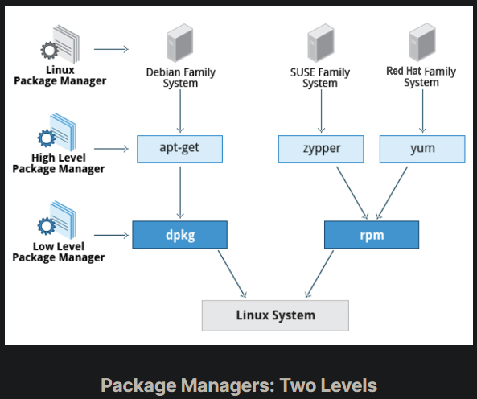
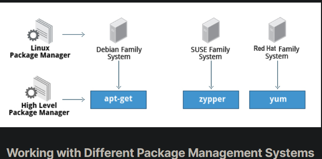
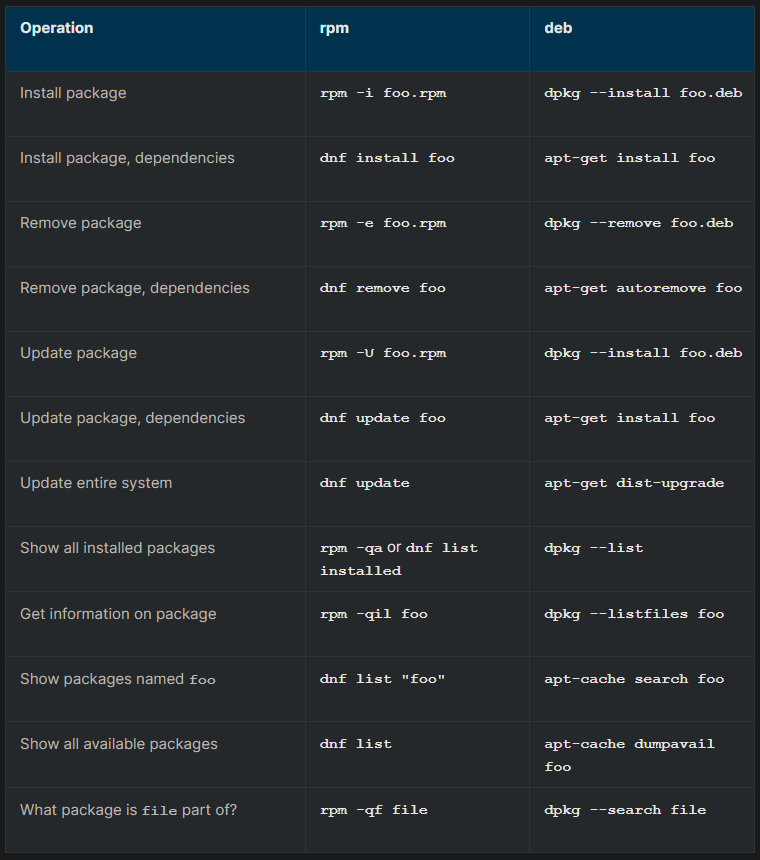

## Package Management Systems on Linux

The core parts of a Linux distribution and most of its add-on software are installed via the Package Management System. Each package contains the files and other instructions needed to make one software component work well and cooperate with the other components that comprise the entire system. Packages can depend on each other. For example, a package for a web-based application written in PHP can depend on the PHP package.

There are two broad families of package managers: those based on Debian and those which use RPM as their low-level package manager. The two systems are incompatible, but broadly speaking, provide the same features and satisfy the same needs. There are some other systems used by more specialized Linux distributions.

In this section, you will learn how to install, remove, or search for packages from the command line using these two package management systems.

## Package Managers: Two Levels

Both package management systems operate on two distinct levels: a low-level tool (such as dpkg or rpm) takes care of the details of unpacking individual packages, running scripts, getting the software installed correctly, while a high-level tool (such as apt-get, dnf, yum, or zypper) works with groups of packages, downloads packages from the vendor, and figures out dependencies.

Most of the time users need to work only with the high-level tool, which will take care of calling the low-level tool as needed. Dependency resolution is a particularly important feature of the high-level tool, as it handles the details of finding and installing each dependency for you. Be careful, however, as installing a single package could result in many dozens or even hundreds of dependent packages being installed.

## Working With Different Package Management Systems

The Advanced Packaging Tool (apt) is the underlying package management system that manages software on Debian-based systems. While it forms the backend for graphical package managers, such as the Ubuntu Software Center and synaptic, its native user interface is at the command line, with programs that include apt (or apt-get) and apt-cache.

dnf is the open source command-line package-management utility for the RPM-compatible Linux systems that belongs to the Red Hat family. dnf has both command line and graphical user interfaces. Fedora and RHEL 8 replaced the older yum utility with dnf, thereby eliminating a lot of historical baggage, as well as introducing many nice new capabilities. dnf is pretty much backwards-compatible with yum for day-to-day commands.

zypper is the package management system for the SUSE/openSUSE family and is also based on RPM. zypper also allows you to manage repositories from the command line. zypper is fairly straightforward to use and resembles dnf/yum quite closely.

To learn the basic packaging commands, take a look at these basic packaging commands:

