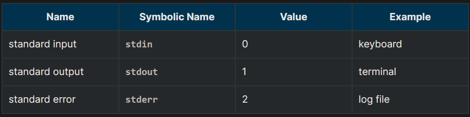
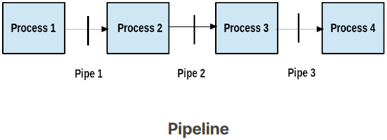
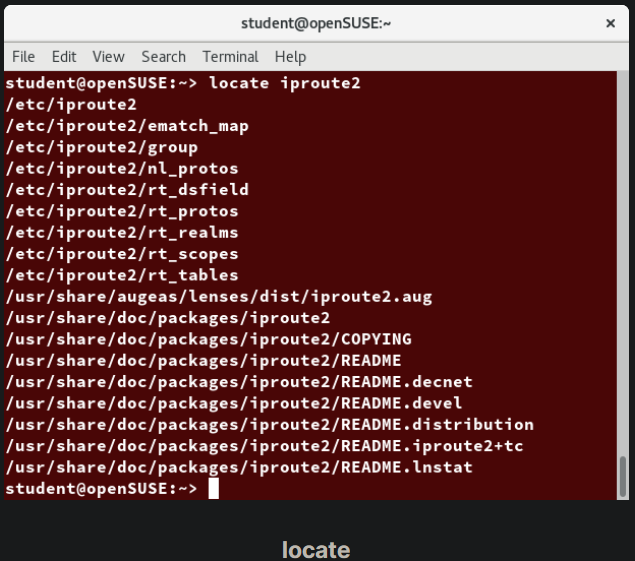
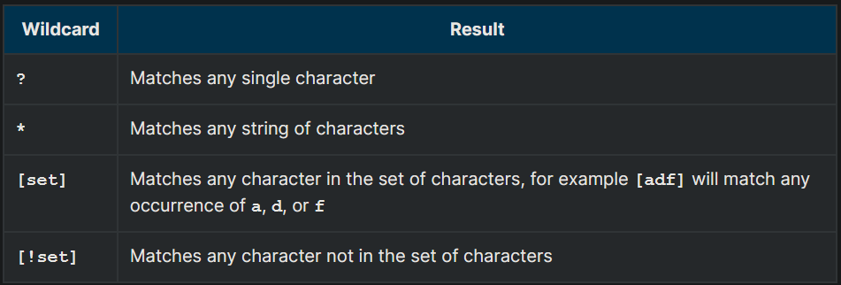
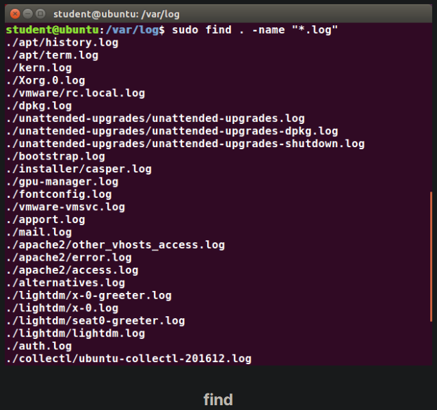
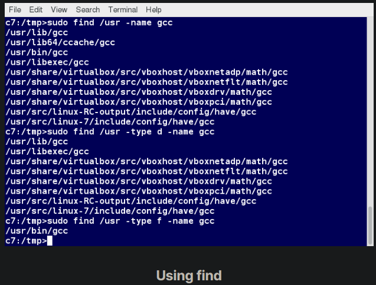
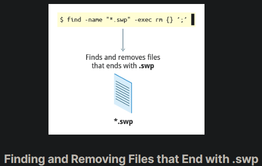
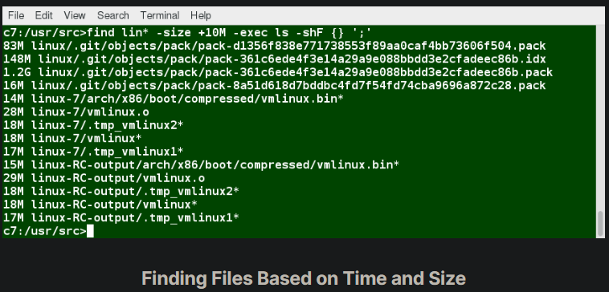

## Standard File Streams

When commands are executed, by default there are three standard file streams (or descriptors) always open for use: standard input (standard in or stdin), standard output (standard out or stdout) and standard error (or stderr).

## I/O Redirection

Through the command shell, we can redirect the three standard file streams so that we can get input from either a file or another command, instead of from our keyboard, and we can write output and errors to files or use them to provide input for subsequent commands.

For example, if we have a program called do_something that reads from stdin and writes to stdout and stderr, we can change its input source by using the less-than sign (<) followed by the name of the file to be consumed for input data:

`$ do_something < input-file`

If you want to send the output to a file, use the greater-than sign (>) as in:

`$ do_something > output-file`

Because stderr is not the same as stdout, error messages will still be seen on the terminal windows in the above example.

If you want to redirect stderr to a separate file, you use stderr’s file descriptor number (2), the greater-than sign (>), followed by the name of the file you want to hold everything the running command writes to stderr:

`$ do_something 2> error-file`

NOTE: By the same logic, do_something 1> output-file is the same as do_something > output-file.

A special shorthand notation can send anything written to file descriptor 2 (stderr) to the same place as file descriptor 1 (stdout): 2>&1.

`$ do_something > all-output-file 2>&1`

bash permits an easier syntax for the above:

`$ do_something >& all-output-file`

## Pipes

The UNIX/Linux philosophy is to have many simple and short programs (or commands) cooperate together to produce quite complex results, rather than have one complex program with many possible options and modes of operation. In order to accomplish this, extensive use of pipes is made. You can pipe the output of one command or program into another as its input.

In order to do this, we use the vertical-bar, pipe symbol (|), between commands as in:
 
$ command1 | command2 | command3

The above represents what we often call a pipeline, and allows Linux to combine the actions of several commands into one. This is extraordinarily efficient because command2 and command3 do not have to wait for the previous pipeline commands to complete before they can begin hacking at the data in their input streams; on multiple CPU or core systems, the available computing power is much better utilized and things get done quicker.

Furthermore, there is no need to save output in (temporary) files between the stages in the pipeline, which saves disk space and reduces reading and writing from disk, which is often the slowest bottleneck in getting something done.

## Searching for Files

Being able to quickly find the files you are looking for will save you time and enhance productivity. You can search for files in both your home directory space, or in any other directory or location on the system.

Being able to quickly find the files you are looking for will save you time and enhance productivity. You can search for files in both your home directory space, or in any other directory or location on the system.

## locate

The locate utility program performs a search taking advantage of a previously constructed database of files and directories on your system, matching all entries that contain a specified character string. This can sometimes result in a very long list.

To get a shorter (and possibly more relevant) list, we can use the grep program as a filter. grep will print only the lines that contain one or more specified strings, as in: 

$ locate zip | grep bin

which will list all the files and directories with both zip and bin in their name. We will cover grep in much more detail later. Notice the use of | to pipe the two commands together.

locate utilizes a database created by a related utility, updatedb. Most Linux systems run this automatically once a day. However, you can update it at any time by just running updatedb from the command line as the root user.

## Wildcards and Matching File Names

You can search for a filename containing specific characters using wildcards.

To search for files using the ? wildcard, replace each unknown character with ?. For example, if you know only the first two letters are 'ba' of a three-letter filename with an extension of .out, type ls ba?.out.

To search for files using the * wildcard, replace the unknown string with *. For example, if you remember only that the extension was .out, type ls *.out.

## The find Program

find is an extremely useful and often-used utility program in the daily life of a Linux system administrator. It recurses down the filesystem tree from any particular directory (or set of directories) and locates files that match specified conditions. The default pathname is always the present working directory.

For example, administrators sometimes scan for potentially large core files (which contain diagnostic information after a program fails) that are more than several weeks old in order to remove them.

It is also common to remove files in inessential or outdated files in /tmp (and other volatile directories, such as those containing cached files) that have not been accessed recently. Many Linux distributions use shell scripts that run periodically (through cron usually) to perform such house cleaning.

## Using find

When no arguments are given, find lists all files in the current directory and all of its subdirectories. Commonly used options to shorten the list include -name (only list files with a certain pattern in their name), -iname (also ignore the case of file names), and -type (which will restrict the results to files of a certain specified type, such as d for directory, l for symbolic link, or f for a regular file, etc.). 

Searching for files and directories named gcc:

`$ find /usr -name gcc`

Searching only for directories named gcc:

`$ find /usr -type d -name gcc`

Searching only for regular files named gcc:

`$ find /usr -type f -name gcc`

## Using Advanced find Options

Another good use of find is being able to run commands on the files that match your search criteria. The -exec option is used for this purpose.

To find and remove all files that end with .swp:

`$ find -name "*.swp" -exec rm {} ’;’`

The {} (squiggly brackets) is a placeholder that will be filled with all the file names that result from the find expression, and the preceding command will be run on each one individually.

Please note that you have to end the command with either ‘;’ (including the single-quotes) or "\;". Both forms are fine.

One can also use the -ok option, which behaves the same as -exec, except that find will prompt you for permission before executing the command. This makes it a good way to test your results before blindly executing any potentially dangerous commands.

## Finding Files Based on Time and Size

It is sometimes the case that you wish to find files according to attributes, such as when they were created, last used, etc., or based on their size. It is easy to perform such searches.

To find files based on time:

`$ find / -ctime 3`

Here, -ctime is when the inode metadata (i.e. file ownership, permissions, etc.) last changed; it is often, but not necessarily, when the file was first created. You can also search for accessed/last read (-atime) or modified/last written (-mtime) times. The number is the number of days and can be expressed as either a number (n) that means exactly that value, +n, which means greater than that number, or -n, which means less than that number. There are similar options for times in minutes (as in -cmin, -amin, and -mmin).

To find files based on sizes:

`$ find / -size 0`

Note the size here is in 512-byte blocks, by default; you can also specify bytes (c), kilobytes (k), megabytes (M), gigabytes (G), etc. As with the time numbers above, file sizes can also be exact numbers (n), +n or -n. For details, consult the man page for find.

For example, to find files greater than 10 MB in size and running a command on those files:

`$ find / -size +10M -exec command {} ’;’`

## 