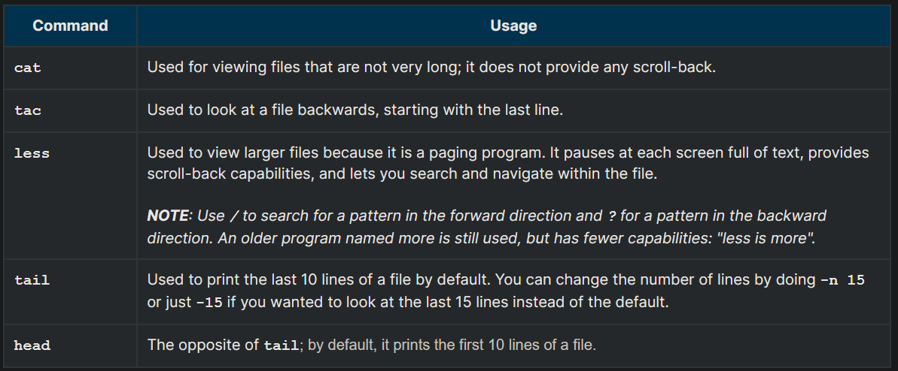
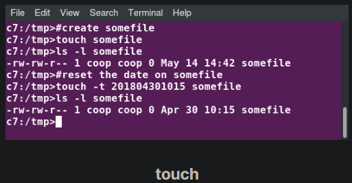
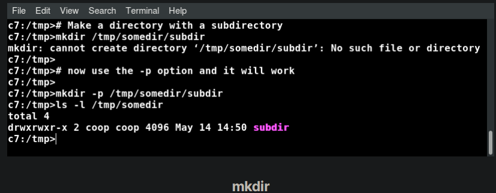
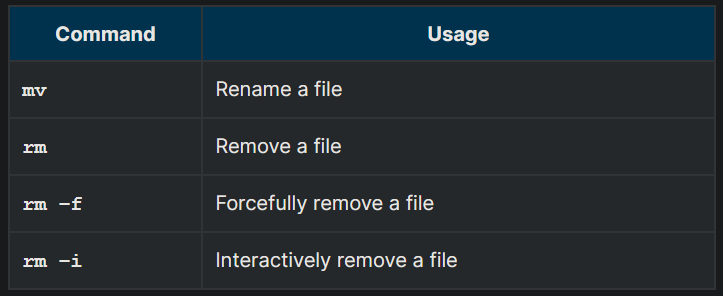

## Viewing Files



## touch

touch is often used to set or update the access, change, and modify times of files. By default, it resets a file's timestamp to match the current time.

However, you can also create an empty file using touch:

`$ touch <filename>`

This is normally done to create an empty file as a placeholder for a later purpose.

touch provides several useful options. For example, the -t option allows you to set the date and timestamp of the file to a specific value, as in:

`$ touch -t 12091600 myfile`

This sets the myfile file's timestamp to 4 p.m., December 9th (12 09 1600).



## mkdir and rmdir

mkdir is used to create a directory:

- `mkdir sampdir` \
It creates a sample directory named sampdir under the current directory. 
- `mkdir /usr/sampdir` \
It creates a sample directory called sampdir under /usr.
Removing a directory is done with rmdir. The directory must be empty or the command will fail. To remove a directory and all of its contents you have to do rm -rf.



## Moving, Renaming or Removing a File

Note that mv does double duty, in that it can:

- Simply rename a file
- Move a file to another location, while possibly changing its name at the same time.
If you are not certain about removing files that match a pattern you supply, it is always good to run rm interactively (rm –i) to prompt before every removal.



## Renaming or Removing a Directory

rmdir works only on empty directories; otherwise you get an error. 

While typing rm –rf is a fast and easy way to remove a whole filesystem tree recursively, it is extremely dangerous and should be used with the utmost care, especially when used by root (recall that recursive means drilling down through all sub-directories, all the way down a tree).


## Modifying the Command Line Prompt

The PS1 variable is the character string that is displayed as the prompt on the command line. Most distributions set PS1 to a known default value, which is suitable in most cases. However, users may want custom information to show on the command line. For example, some system administrators require the user and the host system name to show up on the command line as in:

`student@c8 $`

This could prove useful if you are working in multiple roles and want to be always reminded of who you are and what machine you are on. The prompt above could be implemented by setting the PS1 variable to: \u@\h \$.

For example:

```
$ echo $PS1
\$
$ PS1="\u@\h \$ "
student@c8 $ echo $PS1
\u@\h \$
student@c8 $
```


By convention, most systems are set up so that the root user has a pound sign (#) as their prompt.