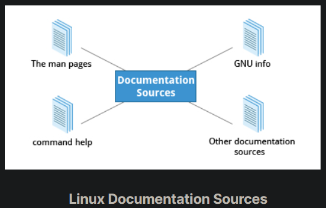

## Linux Documentation Sources

Whether you are an inexperienced user or a veteran, you will not always know (or remember) the proper use of various Linux programs and utilities: what is the command to type, what options does it take, etc. You will need to consult help documentation regularly. Because Linux-based systems draw from a large variety of sources, there are numerous reservoirs of documentation and ways of getting help. Distributors consolidate this material and present it in a comprehensive and easy-to-use manner.

