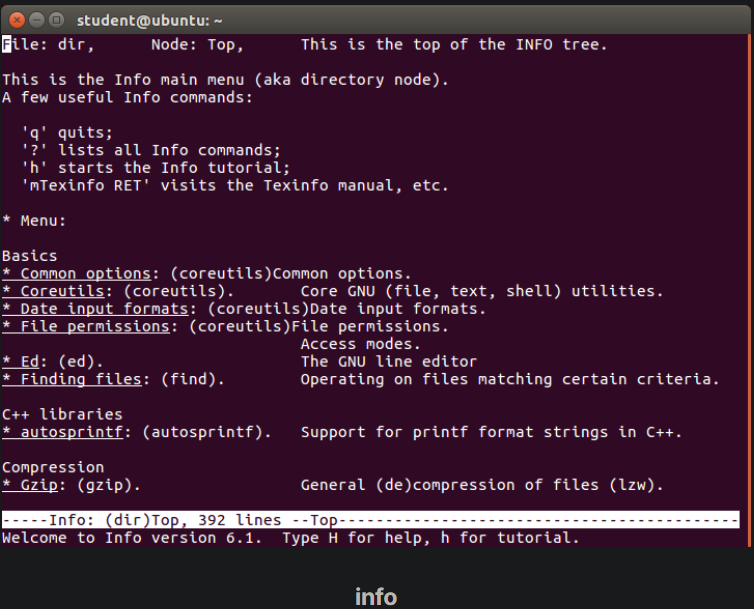
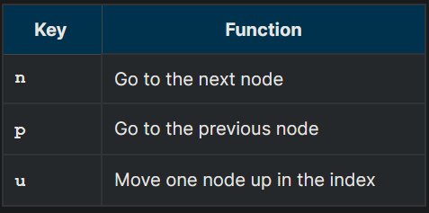

## The GNU Info System

The next source of Linux documentation is the GNU Info System.

This is the GNU project's standard documentation format, which it prefers as an alternative to man. The Info System is basically free-form, and supports linked subsections.

Functionally, info resembles man in many ways. However, topics are connected using links (even though its design predates the World Wide Web). Information can be viewed through either a command line interface, a graphical help utility, printed or viewed online.

## Using info from the Command Line

Typing info with no arguments in a terminal window displays an index of available topics. You can browse through the topic list using the regular movement keys: arrows, Page Up, and Page Down.

You can view help for a particular topic by typing info <topic name>. The  system then searches for the topic in all available info files.

Some useful keys are: q to quit, h for help, and Enter to select a menu item.

## info Page Structure

The topic which you view in an info page is called a node. The table lists the basic keystrokes for moving between nodes.

Nodes are essentially sections and subsections in the documentation. You can move between nodes or view each node sequentially. Each node may contain menus and linked subtopics, or items.

Items function like browser links and are identified by an asterisk (*) at the beginning of the item name. Named items (outside a menu) are identified with double-colons (::) at the end of the item name. Items can refer to other nodes within the file or to other files. 

