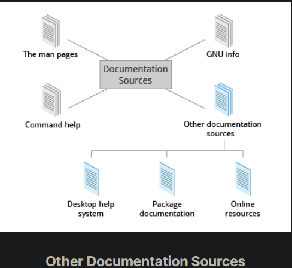
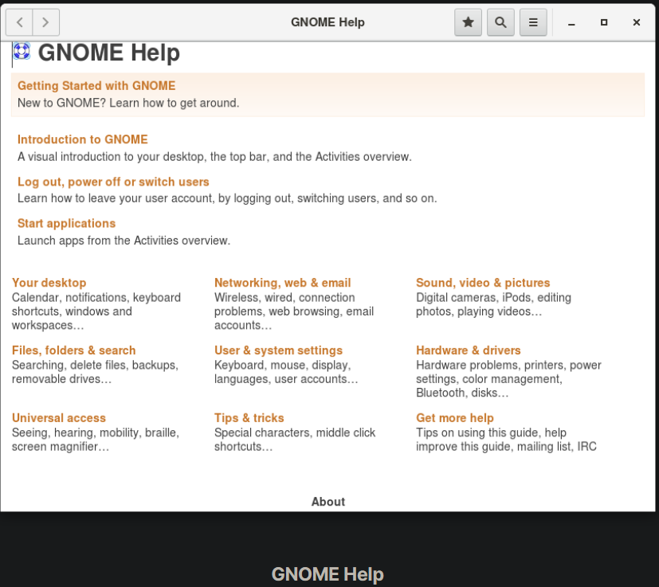
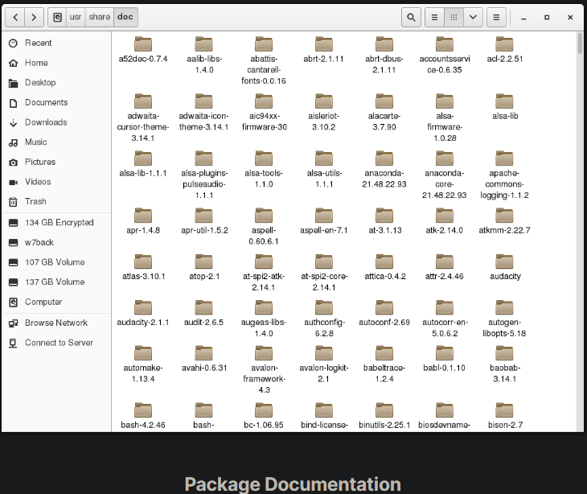

## Other Documentation Sources

In addition to the man pages, the GNU Info System, and the help command, there are other sources of Linux documentation, some examples of which include:

- Desktop help system
- Package documentation
- Online resources.

## Graphical Help Systems

All Linux desktop systems have a graphical help application. This application is usually displayed as a question-mark icon or an image of a ship’s life-preserver, and can also always be found within the menu system. These programs usually contain custom help for the desktop itself and some of its applications, and will sometimes also include graphically-rendered info and man pages.

If you do not want to spend time hunting for the right icon or menu item to launch the help application, you can also start the graphical help system from a terminal window or command prompt by using one of the following utility programs:

- GNOME: gnome-help or yelp
- KDE: khelpcenter

## Package Documentation

Linux documentation is also available as part of the package management system. Usually, this documentation is directly pulled from the upstream source code, but it can also contain information about how the distribution packaged and set up the software.

Such information is placed under the /usr/share/doc directory, grouped in subdirectories named after each package, perhaps including the version number in the name.

## Online Resources

There are many places to access online Linux documentation, and a little bit of searching will get you buried in it.

The following book has been well-reviewed by other users of this course. It is a free, downloadable command line compendium under a Creative Commons license: "The Linux Command Line" by William Shotts.

You can also find very helpful documentation for each distribution. Each distribution has its own user-generated forums and wiki sections. Here are just a few links to such sources:

- Ubuntu Documentation
- CentoS Documentation
- openSUSE Documentation
- Gentoo Documentation
- Fedora Documentation.

Moreover, you can use online search sites to locate helpful resources from all over the Internet, including blog posts, forum and mailing list posts, news articles, and so on.