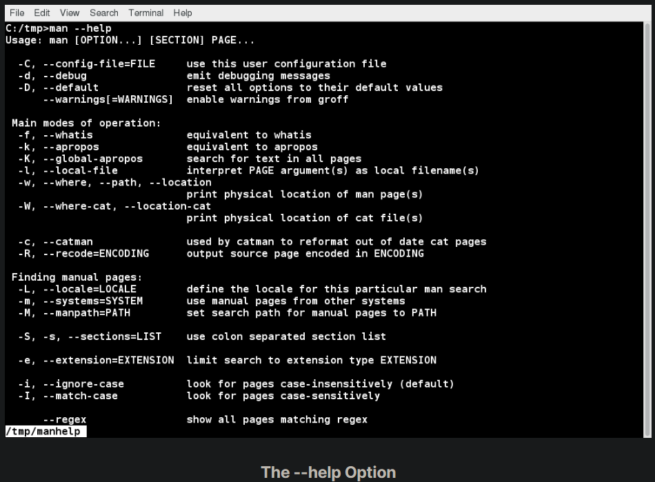
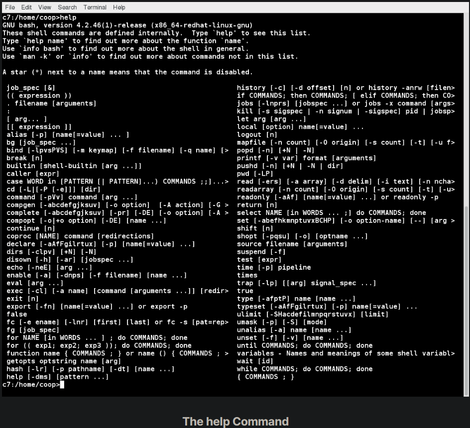

## The --help Option and help Command

Another important source of Linux documentation is use of the --help option.

Most commands have an available short description which can be viewed using the --help or the -h option along with the command or application. For example, to learn more about the man command, you can type: 

`$ man --help`

The --help option is useful as a quick reference and it displays information faster than the man or info pages.

## The help Command

When run within a bash command shell, some popular commands (such as echo and cd) actually run especially built-in bash versions of the commands rather than the usual binaries found on the file system, say under /bin or /usr/bin. It is more efficient to do so as execution is faster because fewer resources are used (we will discuss command shells later). One should note that there can be some (usually small) differences in the two versions of the command.

To view a synopsis of these built-in commands, you can simply type help as shown in the screenshot.

For these built-in commands, help performs the same basic function as the -h and --help arguments perform for standalone programs.

## 