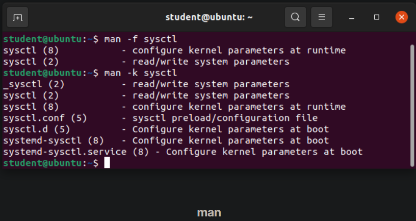
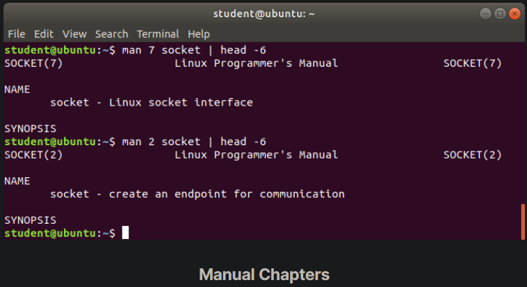

## The man pages

The man pages are the most often-used source of Linux documentation. They provide in-depth documentation about many programs and utilities, as well as other topics, including configuration files, and programming APIs for system calls, library routines, and the kernel. They are present on all Linux distributions and are always at your fingertips.

The man pages infrastructure was first introduced in the early UNIX versions, at the beginning of the 1970s. The name man is just an abbreviation for manual.

Typing man with a topic name as an argument retrieves the information stored in the topic's man pages.

man pages are often converted to other formats, such as PDF documents and web pages. To learn more, take a look at Linux man pages online. Many web pages have a graphical interface for help items, which may include man pages.

Other sources of documentation include published books and many Internet sites.

## man

A given topic may have multiple pages associated with it and there is a default order determining which one is displayed when no options or section number is specified. To list all pages on the topic, use the -f option. To list all pages that discuss a specific topic (even if the specified subject is not present in the name), use the –k option.

- man –f generates the same result as typing whatis.
- man –k generates the same result as typing apropos.
The default order is specified in /etc/man_db.conf and is roughly (but not exactly) in ascending numerical order by section.

## Manual Chapters

The man pages are divided into chapters numbered 1 through 9. In some cases, a letter is appended to the chapter number to identify a specific topic. For example, many pages describing part of the X Window API are in chapter 3X.

The chapter number can be used to force man to display the page from a particular chapter. It is common to have multiple pages across multiple chapters with the same name, especially for names of library functions or system calls.

With the -a parameter, man will display all pages with the given name in all chapters, one after the other, as in:

`$ man -a socket`

## 