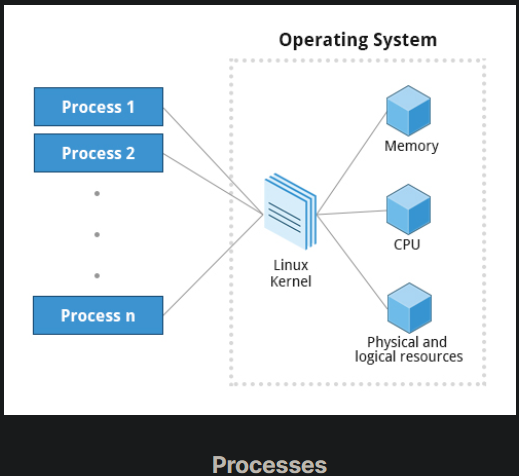
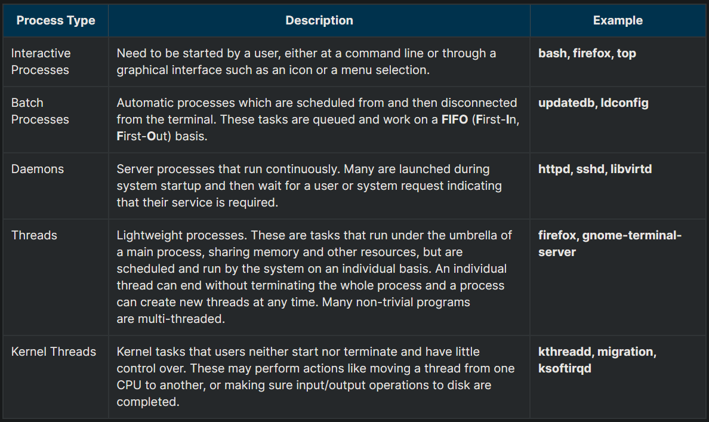
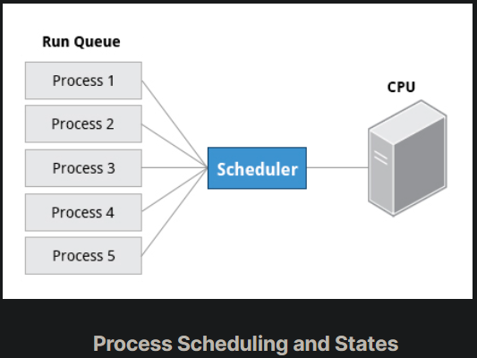
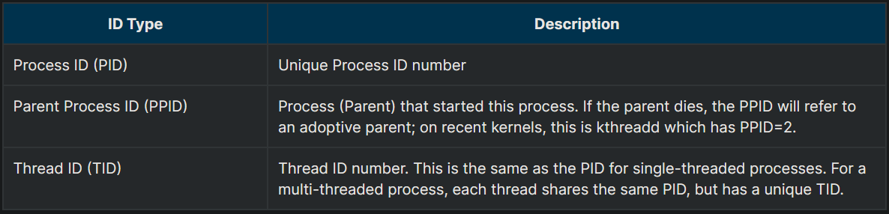
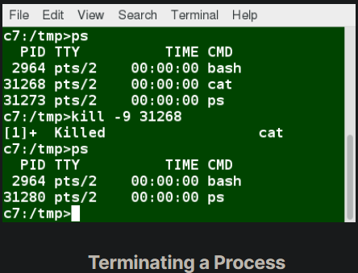
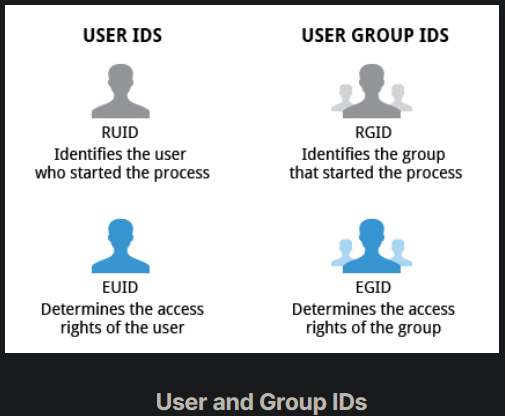
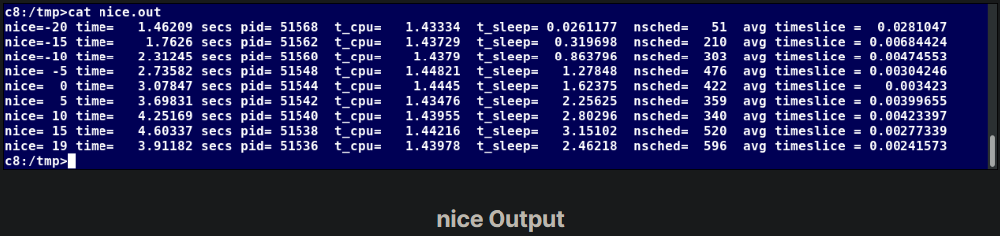

## What Is a Process?

A process is simply an instance of one or more related tasks (threads) executing on your computer. It is not the same as a program or a command. A single command may actually start several processes simultaneously. Some processes are independent of each other and others are related. A failure of one process may or may not affect the others running on the system.

Processes use many system resources, such as memory, CPU (central processing unit) cycles, and peripheral devices, such as network cards, hard drives, printers and displays. The operating system (especially the kernel) is responsible for allocating a proper share of these resources to each process and ensuring overall optimized system utilization.

## Process Types

A terminal window (one kind of command shell) is a process that runs as long as needed. It allows users to execute programs and access resources in an interactive environment. You can also run programs in the background, which means they become detached from the shell.

Processes can be of different types according to the task being performed. Here are some different process types, along with their descriptions and examples:

## Process Scheduling and States

A critical kernel function called the scheduler constantly shifts processes on and off the CPU, sharing time according to relative priority, how much time is needed and how much has already been granted to a task.

When a process is in a so-called running state, it means it is either currently executing instructions on a CPU, or is waiting to be granted a share of time (a time slice) so it can execute. All processes in this state reside on what is called a run queue and on a computer with multiple CPUs, or cores, there is a run queue on each.

However, sometimes processes go into what is called a sleep state, generally when they are waiting for something to happen before they can resume, perhaps for the user to type something. In this condition, a process is said to be sitting in a wait queue.

There are some other less frequent process states, especially when a process is terminating. Sometimes, a child process completes, but its parent process has not asked about its state. Amusingly, such a process is said to be in a zombie state; it is not really alive, but still shows up in the system's list of processes.

## Process and Thread IDs

At any given time, there are always multiple processes being executed. The operating system keeps track of them by assigning each a unique process ID (PID) number. The PID is used to track process state, CPU usage, memory use, precisely where resources are located in memory, and other characteristics.

New PIDs are usually assigned in ascending order as processes are born. Thus, PID 1 denotes the init process (initialization process), and succeeding processes are gradually assigned higher numbers.

The table explains the PID types and their descriptions:

## Terminating a Process

At some point, one of your applications may stop working properly. How do you eliminate it?

To terminate a process, you can type kill -SIGKILL <pid> or kill -9 <pid>.

Note, however, you can only kill your own processes; those belonging to another user are off limits, unless you are root.

## User and Group IDs

Many users can access a system simultaneously, and each user can run multiple processes. The operating system identifies the user who starts the process by the Real User ID (RUID) assigned to the user.

The user who determines the access rights for the users is identified by the Effective UID (EUID). The EUID may or may not be the same as the RUID.

Many users can access a system simultaneously, and each user can run multiple processes. The operating system identifies the user who starts the process by the Real User ID (RUID) assigned to the user.

The user who determines the access rights for the users is identified by the Effective UID (EUID). The EUID may or may not be the same as the RUID.

Users can be categorized into various groups. Each group is identified by the Real Group ID (RGID). The access rights of the group are determined by the Effective Group ID (EGID). Each user can be a member of one or more groups.

Most of the time we ignore these details and just talk about the User ID (UID) and Group ID (GID).

## More About Priorities

At any given time, many processes are running (i.e. in the run queue) on the system. However, a CPU can actually accommodate only one task at a time, just like a car can have only one driver at a time. Some processes are more important than others, so Linux allows you to set and manipulate process priority. Higher priority processes get preferential access to the CPU.

The priority for a process can be set by specifying a nice value, or niceness, for the process. The lower the nice value, the higher the priority. Low values are assigned to important processes, while high values are assigned to processes that can wait longer. A process with a high nice value simply allows other processes to be executed first. In Linux, a nice value of -20 represents the highest priority and +19 represents the lowest. While this may sound backwards, this convention (the nicer the process, the lower the priority) goes back to the earliest days of UNIX.

You can also assign a so-called real-time priority to time-sensitive tasks, such as controlling machines through a computer or collecting incoming data. This is just a very high priority and is not to be confused with what is called hard real-time which is conceptually different, and has more to do with making sure a job gets completed within a very well-defined time window.