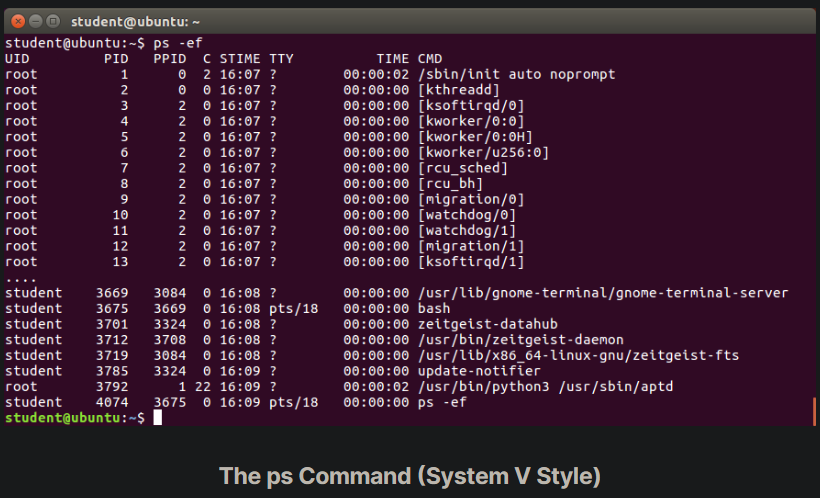
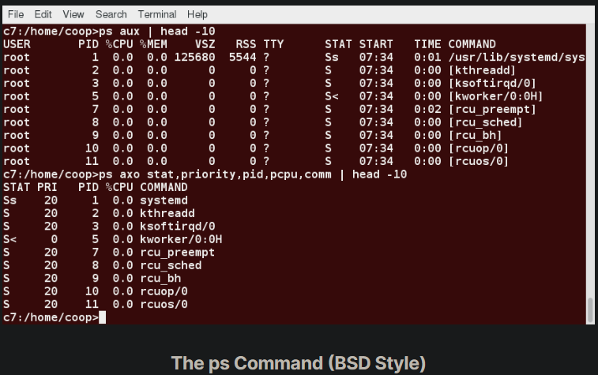
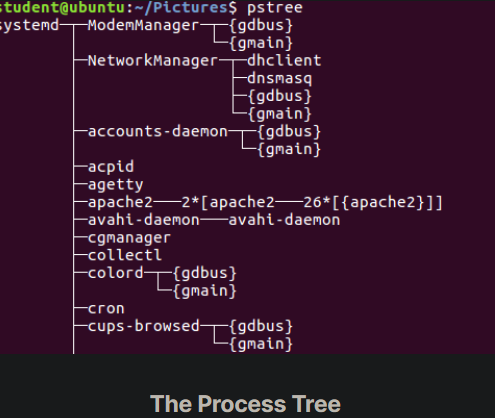
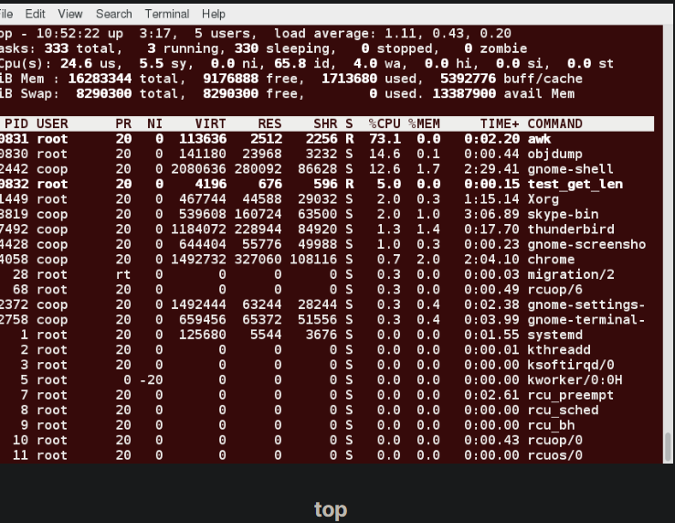
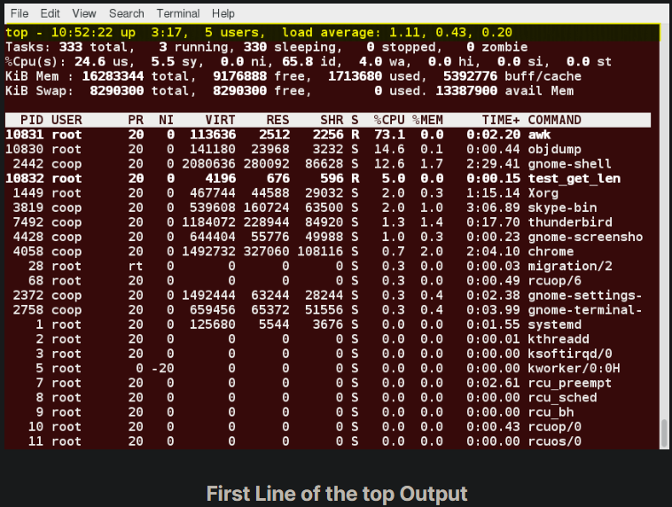
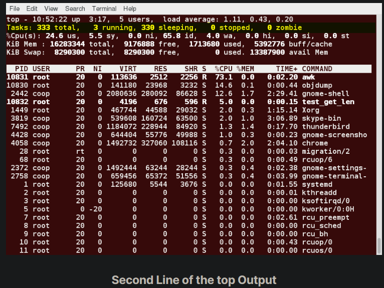
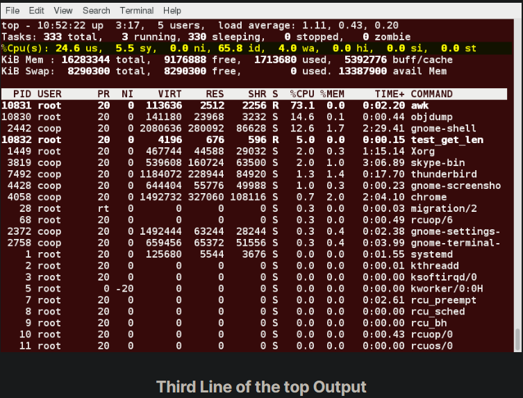
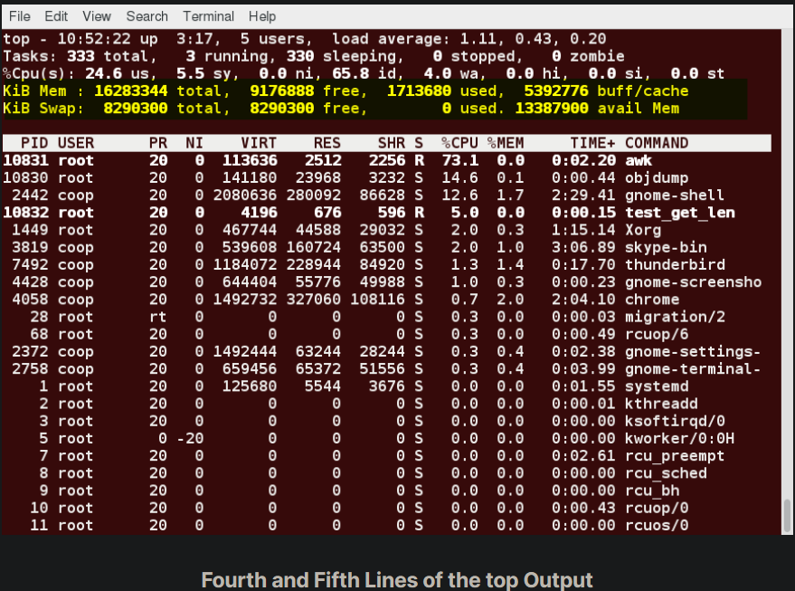
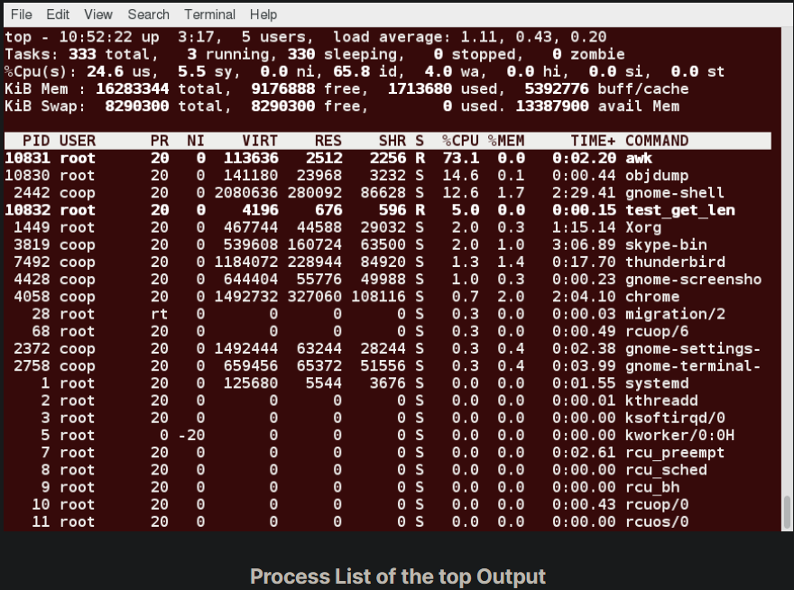
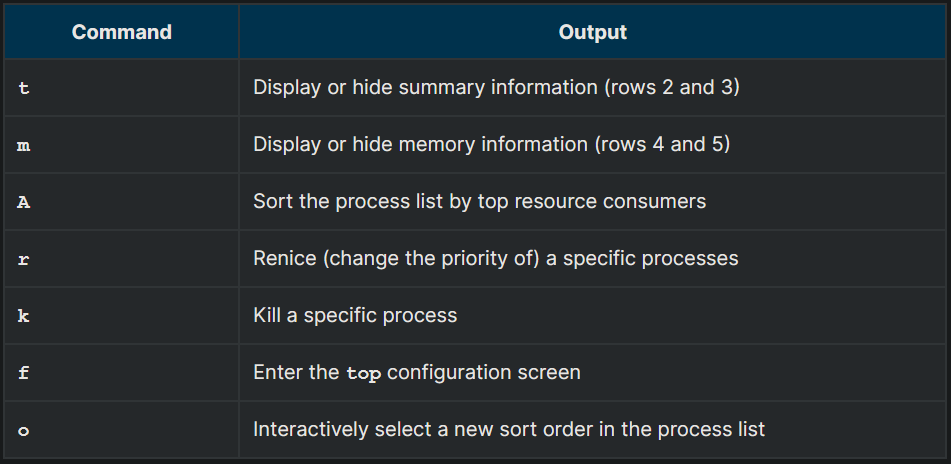

## The ps Command (System V Style)

ps provides information about currently running processes keyed by PID. If you want a repetitive update of this status, you can use top or other commonly installed variants (such as htop or atop) from the command line, or invoke your distribution's graphical system monitor application.

ps has many options for specifying exactly which tasks to examine, what information to display about them, and precisely what output format should be used.

Without options, ps will display all processes running under the current shell. You can use the -u option to display information of processes for a specified username. The command ps -ef displays all the processes in the system in full detail. The command ps -eLf goes one step further and displays one line of information for every thread (remember, a process can contain multiple threads).

## The ps Command (BSD Style)

ps has another style of option specification, which stems from the BSD variety of UNIX, where options are specified without preceding dashes. For example, the command ps aux displays all processes of all users. The command ps axo allows you to specify which attributes you want to view.

The screenshot shows a sample output of ps with the aux and axo qualifiers.

## The Process Tree

pstree displays the processes running on the system in the form of a tree diagram showing the relationship between a process and its parent process and any other processes that it created. Repeated entries of a process are not displayed, and threads are displayed in curly braces.

## top

While a static view of what the system is doing is useful, monitoring the system performance live over time is also valuable. One option would be to run ps at regular intervals, say, every few seconds. A better alternative is to use top to get constant real-time updates (every two seconds by default), until you exit by typing q.top clearly highlights which processes are consuming the most CPU cycles and memory (using appropriate commands from within top).

## First Line of the top Output

The first line of the top output displays a quick summary of what is happening in the system, including:

- How long the system has been up
- How many users are logged on
- What is the load average

The load average determines how busy the system is. A load average of 1.00 per CPU indicates a fully subscribed, but not overloaded, system. If the load average goes above this value, it indicates that processes are competing for CPU time. If the load average is very high, it might indicate that the system is having a problem, such as a runaway process (a process in a non-responding state).

## Second Line of the top Output

The second line of the top output displays the total number of processes, the number of running, sleeping, stopped, and zombie processes. Comparing the number of running processes with the load average helps determine if the system has reached its capacity or perhaps a particular user is running too many processes. The stopped processes should be examined to see if everything is running correctly.

## Third Line of the top Output

The third line of the top output indicates how the CPU time is being divided between the users (us) and the kernel (sy) by displaying the percentage of CPU time used for each.

The percentage of user jobs running at a lower priority (niceness - ni) is then listed. Idle mode (id) should be low if the load average is high, and vice versa. The percentage of jobs waiting (wa) for I/O is listed. Interrupts include the percentage of hardware (hi) vs. software interrupts (si). Steal time (st) is generally used with virtual machines, which has some of its idle CPU time taken for other uses.

## Fourth and Fifth Lines of the top Output

The fourth and fifth lines of the top output indicate memory usage, which is divided in two categories:

- Physical memory (RAM) – displayed on line 4.
- Swap space – displayed on line 5.

Both categories display total memory, used memory, and free space.

You need to monitor memory usage very carefully to ensure good system performance. Once the physical memory is exhausted, the system starts using swap space (temporary storage space on the hard drive) as an extended memory pool, and since accessing disk is much slower than accessing memory, this will negatively affect system performance.

If the system starts using swap often, you can add more swap space. However, adding more physical memory should also be considered.

## Process List of the top Output

Each line in the process list of the top output displays information about a process. By default, processes are ordered by highest CPU usage. The following information about each process is displayed:

- Process Identification Number (PID)
- Process owner (USER)
- Priority (PR) and nice values (NI)
- Virtual (VIRT), physical (RES), and shared memory (SHR)
- Status (S)
- Percentage of CPU (%CPU) and memory (%MEM) used
- Execution time (TIME+)
- Command (COMMAND).

## Interactive Keys with top

Besides reporting information, top can be utilized interactively for monitoring and controlling processes. While top is running in a terminal window, you can enter single-letter commands to change its behavior. For example, you can view the top-ranked processes based on CPU or memory usage. If needed, you can alter the priorities of running processes or you can stop/kill a process.

The table lists what happens when pressing various keys when running top:

