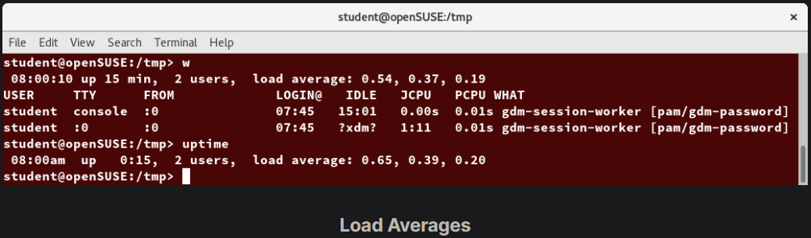
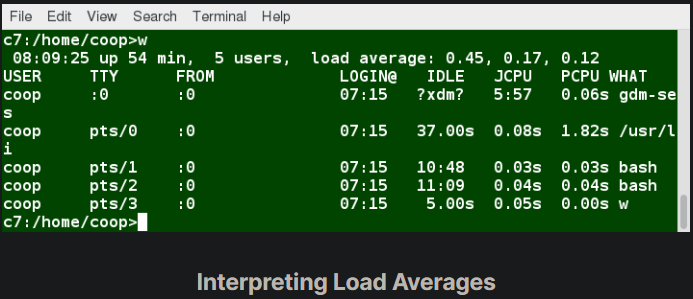
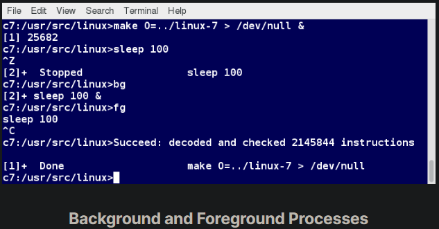
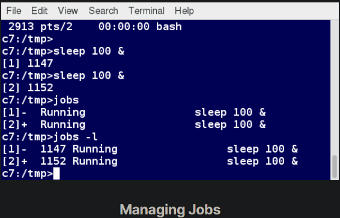

## Load Averages

The load average is the average of the load number for a given period of time. It takes into account processes that are:

Actively running on a CPU.
Considered runnable, but waiting for a CPU to become available.
Sleeping: i.e. waiting for some kind of resource (typically, I/O) to become available.
NOTE: Linux differs from other UNIX-like operating systems in that it includes the sleeping processes. Furthermore, it only includes so-called uninterruptible sleepers, those which cannot be awakened easily.

The load average can be viewed by running w, top or uptime. We will explain the numbers on the next page.

## Interpreting Load Averages

The load average is displayed using three numbers (0.45, 0.17, and 0.12) in the below screenshot. Assuming our system is a single-CPU system, the three load average numbers are interpreted as follows:

- 0.45: For the last minute the system has been 45% utilized on average.
- 0.17: For the last 5 minutes utilization has been 17%.
- 0.12: For the last 15 minutes utilization has been 12%.

If we saw a value of 1.00 in the second position, that would imply that the single-CPU system was 100% utilized, on average, over the past 5 minutes; this is good if we want to fully use a system. A value over 1.00 for a single-CPU system implies that the system was over-utilized: there were more processes needing CPU than CPU was available.

If we had more than one CPU, say a quad-CPU system, we would divide the load average numbers by the number of CPUs. In this case, for example, seeing a 1 minute load average of 4.00 implies that the system as a whole was 100% (4.00/4) utilized during the last minute.

Short-term increases are usually not a problem. A high peak you see is likely a burst of activity, not a new level. For example, at start up, many processes start and then activity settles down. If a high peak is seen in the 5 and 15 minute load averages, it may be cause for concern.

## Background and Foreground Processes

Linux supports background and foreground job processing. A job in this context is just a command launched from a terminal window. Foreground jobs run directly from the shell, and when one foreground job is running, other jobs need to wait for shell access (at least in that terminal window if using the GUI) until it is completed. This is fine when jobs complete quickly. But this can have an adverse effect if the current job is going to take a long time (even several hours) to complete.

In such cases, you can run the job in the background and free the shell for other tasks. The background job will be executed at lower priority, which, in turn, will allow smooth execution of the interactive tasks, and you can type other commands in the terminal window while the background job is running. By default, all jobs are executed in the foreground. You can put a job in the background by suffixing & to the command, for example: updatedb &.

You can either use CTRL-Z to suspend a foreground job or CTRL-C to terminate a foreground job and can always use the bg and fg commands to run a process in the background and foreground, respectively.

## Managing Jobs

The jobs utility displays all jobs running in background. The display shows the job ID, state, and command name, as shown here.

jobs -l provides the same information as jobs, and adds the PID of the background jobs.

The background jobs are connected to the terminal window, so, if you log off, the jobs utility will not show the ones started from that window.

