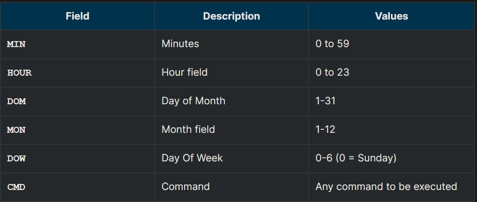

## Scheduling Future Processes Using at

Suppose you need to perform a task on a specific day sometime in the future. However, you know you will be away from the machine on that day. How will you perform the task? You can use the at utility program to execute any non-interactive command at a specified time, as illustrated in the screenshot below:

## cron

cron is a time-based scheduling utility program. It can launch routine background jobs at specific times and/or days on an on-going basis. cron is driven by a configuration file called /etc/crontab (cron table), which contains the various shell commands that need to be run at the properly scheduled times. There are both system-wide crontab files and individual user-based ones. Each line of a crontab file represents a job, and is composed of a so-called CRON expression, followed by a shell command to execute.

Typing crontab -e will open the crontab editor to edit existing jobs or to create new jobs. Each line of the crontab file will contain 6 fields:

Examples:

- The entry * * * * * /usr/local/bin/execute/this/script.sh will schedule a job to execute script.sh every minute of every hour of every day of the month, and every month and every day in the week.
- The entry 30 08 10 06 * /home/sysadmin/full-backup will schedule a full-backup at 8.30 a.m., 10-June, irrespective of the day of the week.

## sleep

Sometimes, a command or job must be delayed or suspended. Suppose, for example, an application has read and processed the contents of a data file and then needs to save a report on a backup system. If the backup system is currently busy or not available, the application can be made to sleep (wait) until it can complete its work. Such a delay might be to mount the backup device and prepare it for writing.

sleep suspends execution for at least the specified period of time, which can be given as the number of seconds (the default), minutes, hours, or days. After that time has passed (or an interrupting signal has been received), execution will resume.

The syntax is:

`sleep NUMBER[SUFFIX]...`

where SUFFIX may be:

- s for seconds (the default)
- m for minutes
- h for hours
- d for days.

sleep and at are quite different; sleep delays execution for a specific period, while at starts execution at a later time.

